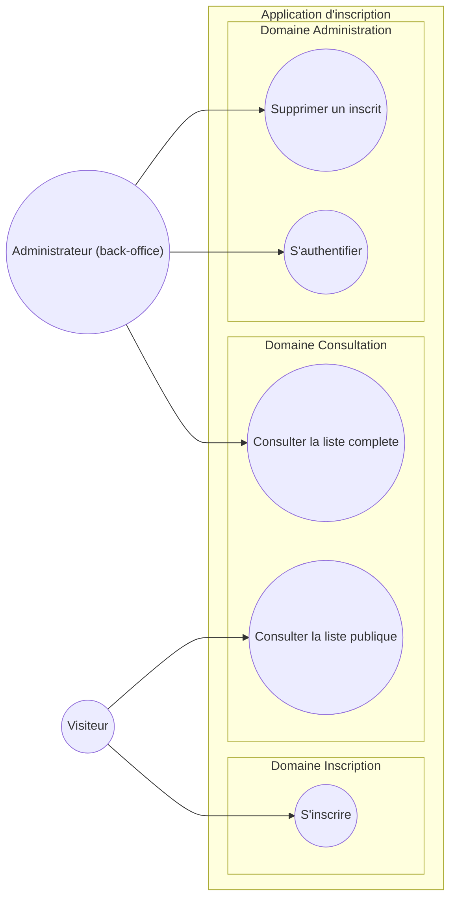

# Diagramme de cas d'usage — inscription — périmètre fonctionnel

> **Feature** : Projet Individuel 2 (app d'inscription full-stack)
> **Statut** : validé contre le sujet officiel (2026-06-18)

## Context

Périmètre fonctionnel du Projet Individuel 2 : qui interagit avec le système et pour
quel but. Cas d'usage groupés par domaine métier (jamais par backend). Ne couvre pas la
structure technique (voir `04-component.md`) ni les flux temporels (voir les séquences).

## Diagramme

## Notes

- L'Administrateur est une spécialisation du Visiteur (il peut aussi s'inscrire et voir
  la liste publique) ; pour la lisibilité il n'est relié qu'à ses buts propres.
- L'authentification (UC4) est une précondition des opérations protégées (UC3, UC5),
  pas un «include» : l'admin se connecte une fois puis enchaîne plusieurs actions.
- Correspondance 1:1 avec le sujet : persistance (UC1), liste réduite (UC2), infos
  privées (UC3), compte admin (UC4), suppression (UC5).
