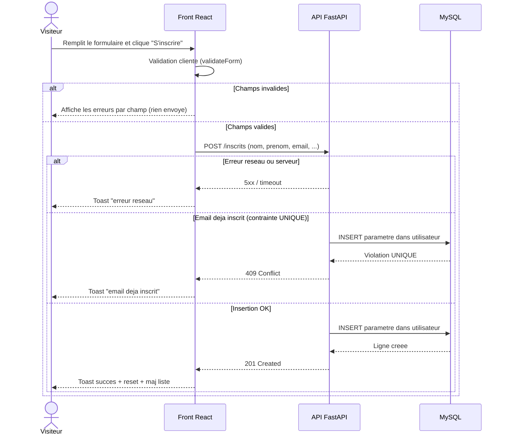

# Diagramme de séquence — inscription — UC1 S'inscrire

> **Feature** : Projet Individuel 2
> **Réalise** : UC1 (voir `01-use-case.md`)

## Context

Flux temporel de l'inscription (front -> API -> MySQL) avec ses branches d'erreur
(validation, réseau, doublon). Diagramme produit car le flux traverse plusieurs
composants et comporte des branches conditionnelles.

## Diagramme

## Notes

- L'`INSERT` est paramétré (aucune concaténation SQL).
- Validation des deux côtés : cliente (UX) et serveur (sécurité, allowlist).
- Le doublon repose sur la contrainte `UNIQUE` de la colonne `email`.
