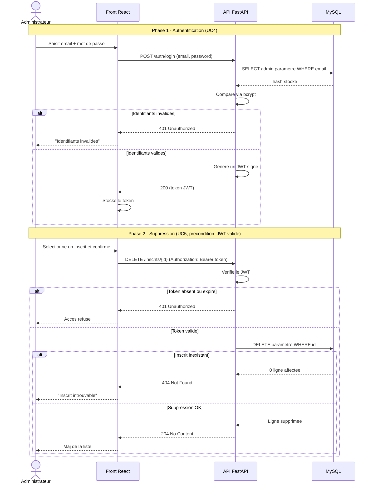

# Diagramme de séquence — inscription — UC4 + UC5 (auth admin + suppression)

> **Feature** : Projet Individuel 2
> **Réalise** : UC4 et UC5 (voir `01-use-case.md`)

## Context

Flux sécurisé : authentification admin (émission JWT) puis suppression d'un inscrit
(opération protégée par le token). Diagramme produit car le flux traverse plusieurs
composants, manipule un secret et comporte des branches d'autorisation.

## Diagramme

## Notes

- Le mot de passe n'est jamais comparé en clair : bcrypt sur le hash stocké.
- Chaque opération protégée revérifie le JWT (autorisation côté serveur).
- Suppression par requête paramétrée ; 404 si l'id n'existe pas.
