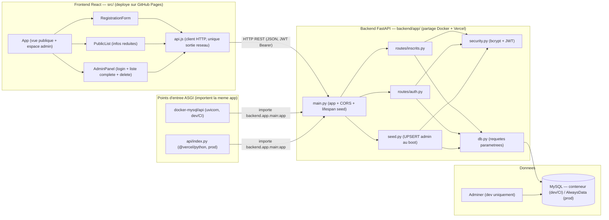

# Diagramme de composants — inscription — structure et déploiement

> **Feature** : Projet Individuel 2
> **Statut** : validé (2026-06-18)

## Context

Structure du système (modules, dépendances, point de sortie réseau) et topologie de
déploiement (GitHub Pages / Vercel / AlwaysData). Répond à "comment c'est structuré",
pas à "qui veut quoi" (voir `01-use-case.md`).

## Diagramme

## Notes

- Une seule sortie réseau côté front (`api.js`) : frontière explicite et testable.
- Backend partagé importé par deux entrées ASGI (uvicorn Docker + `api/index.py`
  Vercel) : zéro duplication de logique.
- `security.py` centralise bcrypt + JWT (réutilisé par auth, routes protégées, seed).
- Même base logique, deux hébergements : conteneur MySQL en dev/CI, AlwaysData en prod.
