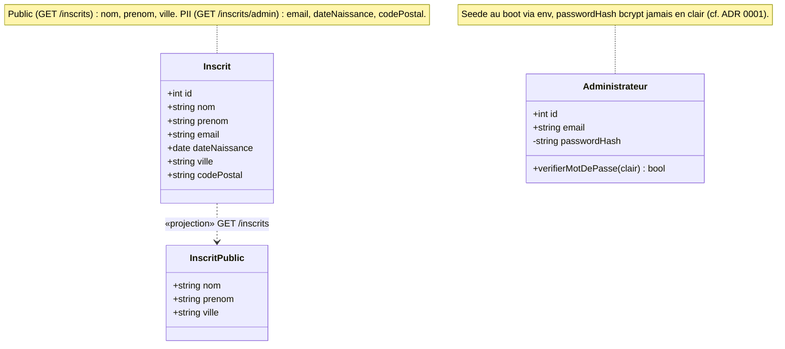

# Diagramme de classes — inscription — modèle de données et exposition

> **Feature** : Projet Individuel 2
> **Statut** : validé (2026-06-18)

## Context

Structure des données persistées (`Inscrit`, `Administrateur`) et frontière
d'exposition : ce qui est rendu public vs ce qui reste privé (PII). Complète les
séquences (02/03, dynamique) et le diagramme de composants (04, structure). La
projection publique est matérialisée par une classe dédiée plutôt que par une
visibilité détournée.

## Diagramme

## Notes

- `InscritPublic` n'est pas une table : c'est la **projection** renvoyée au visiteur
  anonyme. La frontière d'exposition publique est exactement nom / prénom / ville.
- `passwordHash` en visibilité privée (`-`) : jamais sérialisé vers le client ; comparé
  via bcrypt côté serveur (cf. ADR 0002).
- **PII (RGPD)** sur `Inscrit` : email, dateNaissance, codePostal. `ville` est retenue
  pour la liste publique car volontairement grossière (cf. 06-data-flow).
- Renvoie vers 02/03 (dynamique), 04 (déploiement), 06 (circulation des données).
