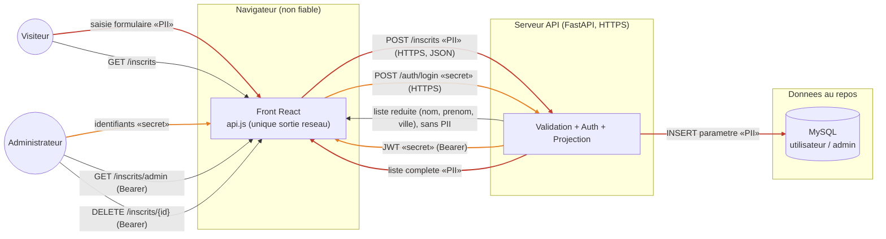

# Diagramme de flux de données — inscription — circulation et PII

> **Feature** : Projet Individuel 2
> **Statut** : validé (2026-06-18)

## Context

Circulation des données entre le visiteur / l'administrateur, le front, l'API et la
base, avec marquage des éléments sensibles : PII (données personnelles) et secrets
(mot de passe, JWT). Met en évidence les frontières de confiance et les flux à
protéger. Complète 05-class (structure) et 04-component (déploiement).

## Diagramme

## Notes

- Tags : `«PII»` = email, dateNaissance, codePostal ; `«secret»` = mot de passe + JWT.
  Rouge = flux porteur de PII, orange = flux porteur de secret.
- PII **en transit** : HTTPS (Pages vers Vercel). PII **au repos** : MySQL (conteneur
  en dev/CI, AlwaysData en prod), accès uniquement par requêtes paramétrées.
- La réponse publique (`GET /inscrits`) ne porte **aucune PII** : c'est la projection
  `InscritPublic` (cf. 05-class).
- Voir aussi : 04 (déploiement Pages / Vercel / AlwaysData), ADR 0002 (gestion du
  secret JWT).
